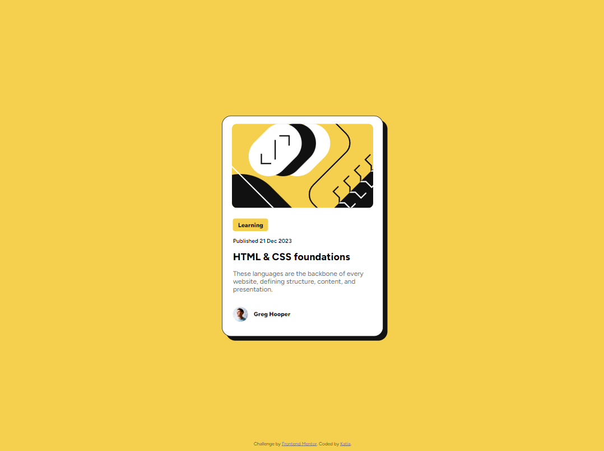
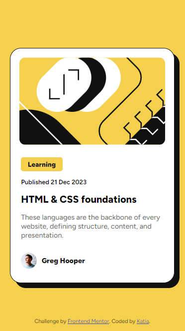
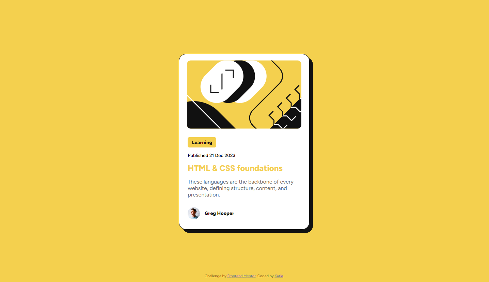

# Frontend Mentor - Blog preview card solution

This is a solution to the [Blog preview card challenge on Frontend Mentor](https://www.frontendmentor.io/challenges/blog-preview-card-ckPaj01IcS). Frontend Mentor challenges help you improve your coding skills by building realistic projects. 

## Table of contents

- [Overview](#overview)
  - [Screenshot](#screenshot)
- [My process](#my-process)
  - [Built with](#built-with)

## Overview
This page it's a blog preview card, which reacts with a color change on the title while the mouse is on top of it. 

### Screenshot

## My process

Since the previous challenge was also a card type, I found this one easier as I had the other page really fresh, ran into fewer questions, and was able to work faster. 
I still have to practice a lot but I have already seen improvements. 

### Built with

- Semantic HTML5 markup
- CSS custom properties
- Flexbox
- CSS Grid